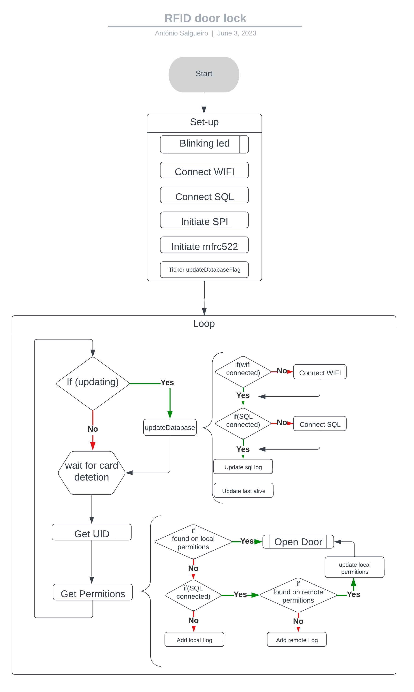

# esp32Door

## connections and diagram
### rfid rc522
- **sda** pin D5
- **sck** pin D18
- **mosi** pin D23
- **miso** pin D19
- **irq** pin  -
- **gnd** pin GND
- **rst** pin D4
- **3.3v** pin 3.3v

### oled 0'91
- **sda** pin D21
- **scl** pin D22

## code flow
